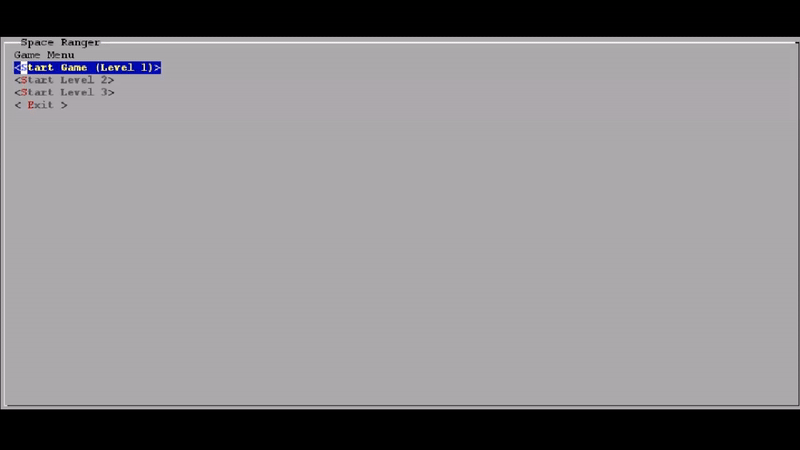
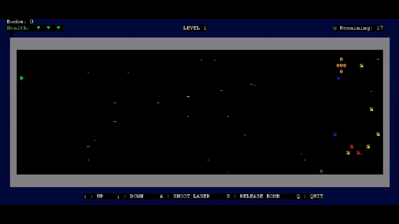
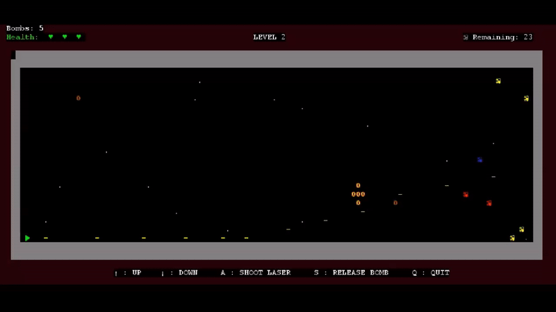
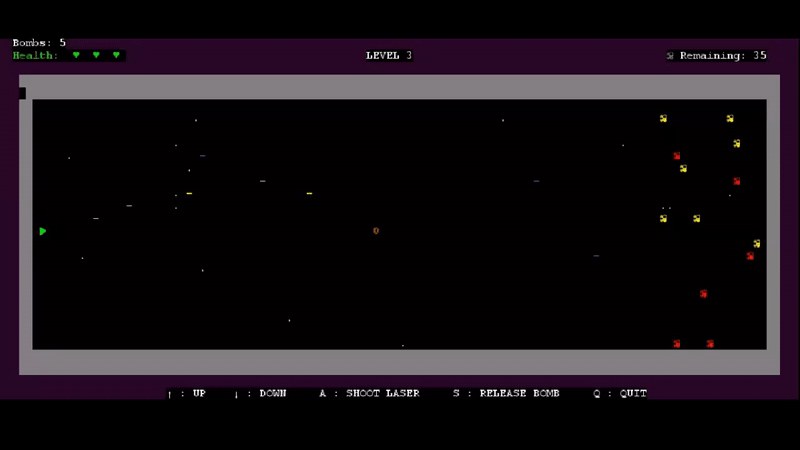
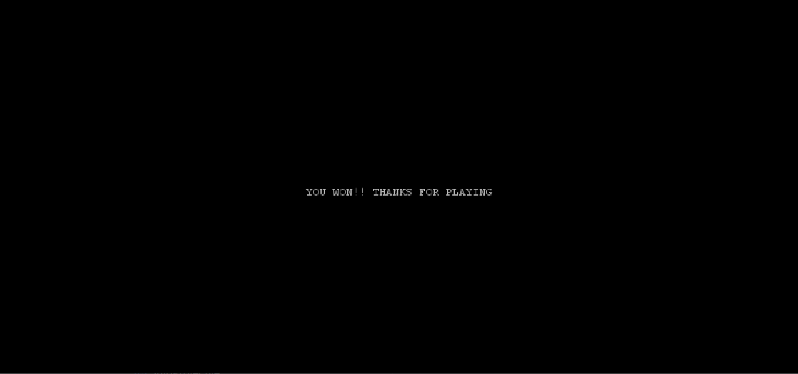
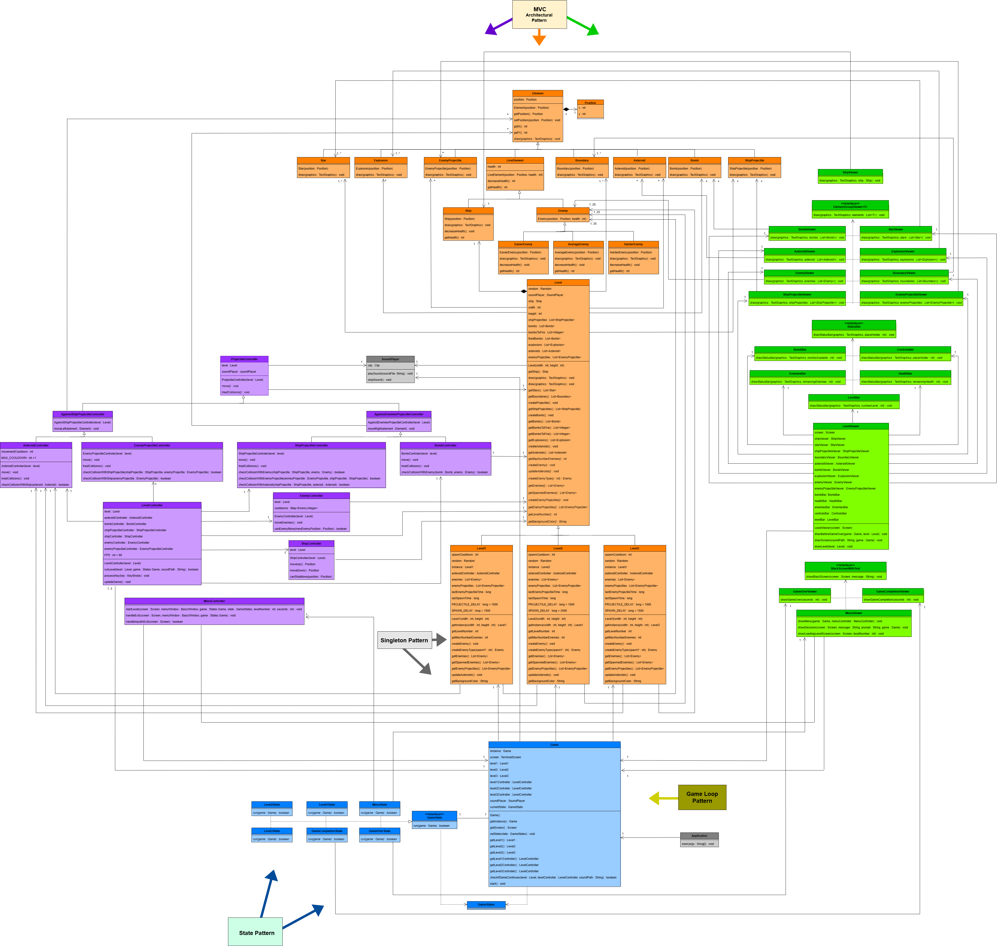
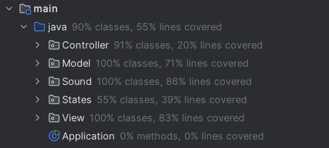

<h3 align="center">Licenciatura em Engenharia Informática e Computação  L.EIC014 - Laboratório de Desenho e Teste de Software  2024/2025 </h3>

---
<h3 align="center"> Colaboradores &#129309 </h2>

| Nome         | Número      |
|--------------|-------------|
| João Marques | up202307612 |
| Tomás Morais | up202304692 |
| Tomás Silva  | up202307796 |

Nota : 16,2

## Space Ranger

## Project Report

**The Space can be a dangerous place. In this 2D space shooter, traverse through the cosmos in a heart pumping adventure where you will dodge asteroids, fight the hardest battles and reclaim space from your enemies.**

**Menu Controls:**

Up/Down Arrow Key -> Navigate through options;
ENTER -> Select option;
Key "y"/"Y" -> Confirm exit of the game; *
Key "n"/"N" -> Go back to the menu. *

* - When the "Exit" option is selected

**Level Controls:**

Up Arrow Key -> Move the ship up;
Down Arrow Key -> Move the ship down;
Key “a”/"A" -> Fire projectile;
Key “s”/"S" -> Fire bomb;
Key “q”/"Q" -> Exit the game.

**Game Screenshots:**

Gif 1 - Menu 

Gif 2 - Level 1

Gif 3 - Level 2

Gif 4 - Level 3

Fig. 1 - Game Over Screen

Fig. 2 - Victory Screen

**Implemented Features:**

Menu - When the game starts, a menu is displayed in the screen. On top the name of the game, "Space Ranger", is shown, followed by four available options: "Start Game (Level1)", "Start Level 2", "Start Level 3" and "Exit". The player can navigate through the menu using the "Up" and "Down" arrow keys on the keyboard and select an option by pressing "ENTER".

Menu Music - While the player stays in the menu, background music will play.

Start Level Options - If the player selects one of the "Start Level" options in the menu, the game will begin at the level referenced in the option name. For example, if the player selects the "Start Level 2" the game will begin at the second level. 

Starting Level Screen - After one of the "Start Level" options is selected, the screen will turn black and display the message "Starting Level", followed by the level number, for a few seconds before the level begins.

Exit Option - If the player selects the "Exit" option, the screen will turn black with the message "Are you sure you want to exit?" displayed. At this point, if the player presses "Y" on the keyboard, the game ends. However, if the player presses "N", the game returns to the menu.

Levels - The game has three levels, each progressively more difficult than the previous one. The increase in difficulty is due to faster and more frequent asteroids, a greater number of enemies, a higher proportion of tougher enemy types, and an increased rate of enemy projectiles targeting the ship.

Ship - The player controls a ship which has 3 health points. Each time the ship is hit by a projectile, its health decreases by one. If it reaches zero, it´s GAME OVER.

Moving The Ship - The ship can be vertically up or down, by pressing th corresponding arrow key;

Firing Projectiles - By pressing "A" on the keyboard, the ship will fire a horizontally directed projectile. The projectile will be destroyed if it hits an asteroid, an enemy or an enemy projectile.

Firing Bombs - By pressing "S" in the keyboard, the ship will fire a horizontally directed bomb. Unlike projectiles, bombs cannot be destroyed and have a wider range, destroying everything in a 2x2 radius along their path. The ship has a limited stock of 5 bombs.

Asteroids - During the levels, an infinite number of horizontally directed asteroids will appear, moving rapidly towards the left. The ship must avoid them, as colliding with an asteroid results in GAME OVER.

Enemies - Each level includes a specific number of enemies that the player must defeat to progress. Enemies come in three types: blue, yellow and red. They differ in health, representing the number of projectiles needed to destroy them (blue: 1, yellow: 3, red: 5). However, all enemies, regardless of type, are destroyed by a single bomb.

Moving Enemies - Enemies will appear randomly and move toward the ship, but will stop at a certain x-coordinate, they will stop (they are not suicidal).

Projectiles Fired by Enemies - The enemies occasionally fire horizontally directed projectiles at the ship. These projectiles, like those fired by the ship, are destroyed upon collision with another projectile. 

Explosions - Each time an enemy dies, the ship is damaged or two projectiles collide with each other, an explosion will be drawn at the respective position;

Level Design - The level layout consists of a rectangular space-themed scenery, bordered by a grey frame. At the center top, the current level number is displayed. At the bottom, the controls are shown. Additional information is displayed at the top of the screen.

Health Bar - On the top left of the terminal screen, the ship´s health is displayed as a series of green hearts, representing the remaining health points. The number of hearts decreases each time the ship is hit.

Remaining Bombs Display - Below the health bar, the number of remaining bombs is displayed. This count decreases by one each time a bomb is fired.

Remaining Enemies Display - On the top right of the terminal screen, the number of remaining enemies, needed to kill, in the level, to progress, is displayed. This count decreases by one each time an enemy is killed.

Stars - To simulate a space ambience and the chaotic nature of the action, stars will constantly flash in the background during the level.

Level Music - Each level has its own unique music that plays while the player is in it. 

Sound Effects - The firing of projectiles and bombs, as well as explosions, are accompanied by corresponding sound effects.

Game Progression - When all enemies in a level are defeated, the game automatically progresses to the next level.

Victory Screen - When all enemies in the third and final level are defeated, the game terminal will close, and a new screen will display the message "YOU WON!! THANKS FOR PLAYING", accompanied by victory audio.

Quitting the Game - During a level, pressing "Q" on the keyboard allows the player to exit the game.

Game Over Screen - If the ship is destroyed or the player exits the level, the game terminal will close, and a new screen will display the message "GAME OVER," accompanied by game-over audio.

**Structure and Design Patterns:**

The Application class contains the main function which initializes the Game instance and calls the start() method of the Game class, which initializes and maintains the game running.

For this project, we decided to implement four design patterns: Singleton, Model-View-Controller (MVC), State Pattern and Game Loop Pattern.

**Singleton:**

**Reasons for the use of Singleton:**

In order for the code´s behaviour to be controlled, during the running of the program, there were certain classes in which only one instance of each related object should be created, so with this objective in mind, we decided to implement Singleton.

**Implementation of Singleton:**

Game, Level1, Level2 and Level3 - Whenever another class needs to use an instance of one of these four classes, the getInstance() method implemented in each of them is called. This method checks whether an instance of the class has already been created. If an instance exists, it returns the existing instance; otherwise, it creates a new single instance and returns it.

**Consequences of the use of Singleton:**

The implementation of Singleton allowed the following benefits:

- Only one instance of each class implementing the Singleton pattern exists during runtime;
- Better control of the code during runtime is insured.

**Model - View - Controller (MVC):**

**Reasons for the use of MVC:**

Before implementing the MVC architectural pattern, a single class contained methods related to the Model, Viewer, and Controller for an object. This code structure not only resulted in overly extensive classes with very long methods but also significantly violated the Single Responsibility Principle. To create more organized code, we decided to refactor the longer methods into smaller ones, each with a specific purpose. These methods were grouped according to their function—representing the object, drawing it, or implementing its behavior—thereby dividing the large classes into three distinct parts: Model, Viewer, and Controller.

**Implementation of MVC**

Regarding MVC, this pattern allowed us to divide the code into three parts:

**Model** - Contains the data and implementation of the different elements that make up the game (e.g., Level, Projectile, Ship, etc.):

Element - Generalizes all the game's elements, extending the classes of the elements that configure an object (they have position coordinates);

Position - Defines the position coordinates of the game's elements, each one having an x-coordinate and a y-coordinate;

LiveElement - A subclass of element that generalizes all the ones that are destroyable and differ from the rest of the elements for having a health attribute (Ship, Enemy), implementing also a getter and a method to decrease the value of that attribute;

Ship - A subclass of LiveElement. Initializes the value of its health attribute and overrides the corresponding methods from the LiveElement class;

Enemy - Is a subclass of LiveElement, while also being an abstract class that generalizes the three different types of enemies (EasierEnemy, AverageEnemy, HarderEnemy);

EasierEnemy, AverageEnemy and HarderEnemy - Subclasses of Enemy. The three initialize the value of their respective health attribute and override the corresponding methods from the LiveElement class.

ShipProjectile, EnemyProjectile Bomb, Explosion, Boundary, Asteroid, Star - Define the constructor of their respective object as well as their drawing method on the screen;

Level - Generalizes the three levels tha are part of the game. It implements methods for creating the objects in each level, as well as getters to be used by other classes, and abstract methods that define the particularities of each level, such as the number of enemies, for example;

Level1, Level2 and Level3 - Implements the first level of the game and its particularities;

**View** - Responsible for the logic of implementing the game's visuals:

LevelViewer - Through its drawScreen() method, it draws the screen to be used as support for the level visuals. Through its drawLevel() method, it draws the game's current state on the screen by calling the drawing methods of the remaining level elements. Through the drawBeforeGameOver(), handles the visuals of the level screen before it closes and the "Game Over" one appears. The three methods are called in the runLevel() method of the Game class;

ElementGroupViewer - Interface that defines the method to draw the elements of the game which are grouped in a list;

AsteroidViewer, ProjectileViewer, BombViewer, ExplosionViewer, EnemyViewer, BoundaryViewer, ShipProjectileViewer, EnemyProjectileViewer, StarViewer - Implement the ElementGroupViewer Interface. Implement the method to draw each of the corresponding element created on the screen;

ShipViewer - Calls the method to draw the player-controlled ship on the screen;

StatusBar - Interface that defines the method to draw the various information bars presents in the level, on the screen;

BombBar, ControlsBar, EnemiesBar, HealthBar, LevelBar - Implement the StatusBar interface. Implement the method to draw each corresponding bar on the screen;

BlackScreenWithText - Interface that defines and implements the method to draw a black screen with white text in the middle;

GameCompletionViewer and GameOverViewer - Implement the BlackScreenWithText interface. When their only methods are called, the visuals of their corresponding States are drawn on the screen.

MenuViewer - Implements the methods to draw the menu elements as well as the screens associated with it, like the "Loading Level" and the "Are you sure you want to exit?" ones. These two consist of a black screen with white text in the middle, so this class also implements the BlackScreenWithText interface.

**Controller** - Interprets user inputs and implements the behavior of the different elements:

LevelController - Through the processKey() method, the inputs provided by the player during the levels are interpreted, calling other methods according to the pressed key. Through the updateGame() method, the behaviour and the "state" of the level´s elements are updated, by calling methods of the other controllers. Both of these methods are repeatedly called in the runLevel() method, which among other things ensures the consistent flow and the constant update of the levels;

ShipController - Defines the options (Up or Down) for the ship´s movement while checking if such movement is possible;

EnemyController - Defines the way enemies move while also checking if such movement is possible;

ProjectileController - Generalizes the controllers of the different kinds of projectiles, defining the methods related to their movement and collisions;

AgainstEnemiesProjectileController - Subclass of ProjectileController that generalizes the controllers of the projectiles fired by the ship (ShipProjectileController and BombController). Through the moveRight() method, the movement of these projectiles is defined as being from left to right;

AgainstShipProjectileController - Subclass of ProjectileController that generalizes the controllers of the projectiles that move towards the ship (EnemyProjectileController and AsteroidController). Through the moveLeft() method, the movement of these projectiles is defined as being from right to left;

ShipProjectileController, EnemyProjectileController, BombController and AsteroidController - Overriding the methods from ProjectileController, it implements the behaviour of the movement of the projectiles and checks and treats the collisions that occur between them and any other element;

MenuController - Through the startLevel() and the handleExit() methods, the behaviour of the menu when the "Start Level" options and the "Exit" option are selected, respectively, is implemented. The user inputs after the selection of the "Exit" option are interpreted through the handleInputInExit() method. 

**Consequences of the use of MVC**

The implementation of the MVC architectural pattern allowed the following benefits:

- More concise and organized code;
- The code is more flexible and, if needed, easier to change, due to the fact that classes and methods serve a single objective and are easier to locate;
- Allowed for the Single Responsibility Principle to be partially respected.

**State:**

**Reasons for the use of State:**

With the inclusion of the Menu, as well as the "Game Over" and "Victory" screens, we observed that they could all be represented as states of the "Game" object, along with the "Level" classes. Before implementing this design pattern, the transitions between these states were managed within each respective controller. However, we decided it was better to handle these transitions separately. Since the game's behavior depended on the current state and the state changed at runtime, we chose to implement the State Design Pattern.

**Implementation of State:**

GameStates - Enumeration of the six different states that our game can have, plus a NULL state;

GameState - Interface that defines the method to posteriorly call the methods used to implement the behaviour and the visuals of a state, that implements it, as well as implementing the different transitions from that state;

MenuState - Implements the GameState interface. Through the run() method, implements the behaviour and visuals of the menu and returns the boolean value to make the game transition another state or end, through the start() method in the "Game" class.

Level1State and Level2State - Implement the GameState interface. Through the run() method, the behaviour and visuals of their respective levels are called, and the transition to the next level, if the current one is beaten, or to the "Game Over" state if not, is handled;

Level3State - Implements the GameState interface. Through the run() method, the behaviour and visuals of the final level are called, and the transition to the "Game Completion" state, if the player beats it, or to the "Game Over" state if not, is handled;

GameOverState and GameCompletionState - Implement the GameStateInterface. Through the run() method, the behaviour and the visuals of each respective state are called, ending the game afterward.

Game - Through the start() method, the game maintains itself running while its internal state is not null. Through the setState() method, it allows for its internal state to be changed.

**Consequences of the use of State:**

The implementation of the State design pattern allowed the following benefits:

- Separation of the transitions between logical parts of the game´s flow from the rest of the code;
- The several states that the game can assume and the transitions between them became more explicit.

**Game Loop Pattern:**

**Reasons for the use of Game Loop Pattern:**

Since the beggining of the project, we wanted to be able to control the frame rate of the game (how often it updates) in order to ensure smooth performance and a pleasant player experience, which was achievable by the implementation of the Game Loop Design Pattern.

**Implementation of Game Loop Pattern:**

LevelController - Through the runLevel() method, a while loop maintains the levels running while certain conditions are met which, if not, end up in the game ending. Inside the loop, several other methods are called like the updateGame(), drawLevel() and processKey() that ensures the continuous update of the game´s behaviour and visuals and the constant reading of the player´s inputs, respectively. Also through the method, the frequency in which the game updates is defines (60 FPS);

Game - The start() method also consists on a loop that keeps the game running while its current state is not null. Also, it initializes several resources needed for the main loop, such as the screen, the levels, the levels´ controllers and the sound player, while providing getters in order for those same resources to be used externally.

**Consequences of the use of Game Loop Pattern:**

The implementation of the Game Loop Pattern allowed the following benefits:

- Constant update of the Game´s behaviour and visuals;
- Smooth frame rate, contributing to the pretended pleasant but intense player experience.

**Sound Management:**

SoundPlayer - Through the playSound() method, the audio related to the string containing the path to its file that it receives as an argument, is played, whenever the method is called. Through the stopSound(), a current playing audio is stopped.

All the audio files are in the .wav format and are present in the "resources" folder of this directory.

**Known Code Smells:**

All errors reported by Error Prone were corrected, and the code was adjusted to eliminate all warnings. No other major code smells were identified.

**UML Class Diagram:**

**Testing:**

**Test Coverage:**

Note : Despite the failure of some tests, we decided to keep them, in order to achieve a greater test coverage.

